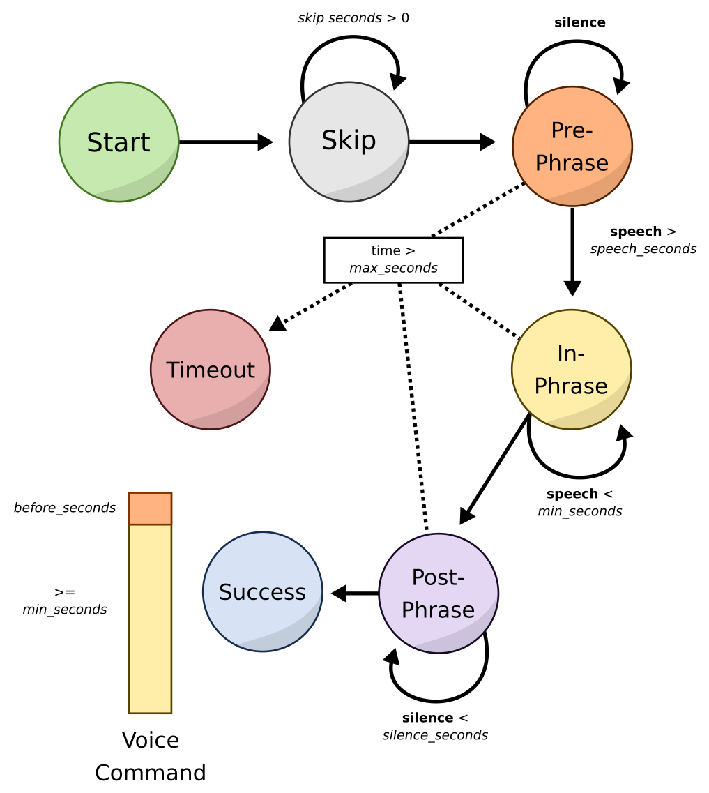

# Rhasspy Whisper
## Fork of [Rhasspy Silence](https://github.com/rhasspy/rhasspy-silence) with added [Faster Whisper](https://github.com/SYSTRAN/faster-whisper) for speech transcription

[](https://github.com/Aktyn/rhasspy-whisper/actions)
[](https://github.com/Aktyn/rhasspy-whisper/blob/master/LICENSE)

Detect speech/silence in voice commands with [webrtcvad](https://github.com/wiseman/py-webrtcvad).

## Requirements

* Python 3.7
* [webrtcvad](https://github.com/wiseman/py-webrtcvad)

## Installation

```bash
$ git clone https://github.com/Aktyn/rhasspy-whisper
$ cd rhasspy-whisper
$ ./configure
$ make
$ make install
```

## How it Works

`rhasspy-whisper` uses a state machine to decide when a voice command has started and stopped. The variables that control this machine are:

* `skip_seconds` - seconds of audio to skip before voice command detection starts
* `speech_seconds` - seconds of speech before voice command has begun
* `before_seconds` - seconds of audio to keep before voice command has begun
* `minimum_seconds` - minimum length of voice command (seconds)
* `maximum_seconds` - maximum length of voice command before timeout (seconds, None for no timeout)
* `silence_seconds` - seconds of silence before a voice command has finished

The sensitivity of `webrtcvad` is set with `vad_mode`, which is a value between 0 and 3 with 0 being the most sensitive.

[](docs/img/state_machine.svg)

If there is no timeout, the final voice command audio will consist of:

* `before_seconds` worth of audio before the voice command had started
* At least `min_seconds` of audio during the voice command

### Energy-Based Silence Detection

Besides just `webrtcvad`, silence detection using the denoised energy of the incoming audio is also supported. There are two energy-based methods:

* Threshold - simple threshold where energy above is considered speech and energy below is silence
* Max/Current Ratio - ratio of maximum energy and current energy value is compared to a threshold
    * Ratio below threshold is considered speech, ratio above is silence
    * Maximum energy value can be provided (static) or set from observed audio (dynamic)
    
Both of the energy methods can be combined with `webrtcvad`. When combined, audio is considered to be silence unless **both** methods detect speech - i.e., `webrtcvad` classifies the audio chunk as speech and the energy value/ratio is above threshold. You can even combine all three methods using `SilenceMethod.ALL`.

# Command Line Interface

A CLI is included to test out the different parameters and silence detection methods. After installation, pipe raw 16-bit 16Khz mono audo to the `bin/rhasspy-whisper` script:

```sh
$ arecord -r 16000 -f S16_LE -c 1 -t raw | bin/rhasspy-whisper <ARGS>
```

The characters printed to the console indicate how `rhasspy-whisper` is classifying audio frames:

* `.` - silence
* `!` - speech
* `S` - transition from silence to speech
* `-` - transition from speech to silence
* `[` - start of voice command
* `]` - end of voice command
* `T` - timeout

By changing the `--output-type` argument, you can have the current audio energy or max/current ratio printed instead. These values can then be used to set threshold values for further testing.

## Splitting By Silence

You can use `rhasspy-whisper` to split audio into WAV files by silence using:

```sh
$ sox audio.wav -t raw - | bin/rhasspy-whisper --quiet --split-dir splits --trim-silence
```

This will split raw 16Khz 16-bit PCM audio into WAV files in a directory named `splits`.
By default, files will simply be numbered (0.wav, 1.wav, etc). Set `--split-format` to change this.

Adding `--trim-silence` is optional, and can be controlled further with other `--trim-*` options (see `--help`).

## Trimming Silence

Silence can be trimmed from the start and end of an audio file with:

```sh
$ sox audio.wav -t raw - | bin/rhasspy-whisper --quiet --trim-silence > trimmed.wav
```

See the other `--trim-*` options with `--help` for more control.

## CLI Arguments

```
usage: rhasspy-whisper [-h]
                       [--output-type {speech_silence,current_energy,max_current_ratio,transcription,none}]
                       [--chunk-size CHUNK_SIZE] [--skip-seconds SKIP_SECONDS]
                       [--max-seconds MAX_SECONDS] [--min-seconds MIN_SECONDS]
                       [--speech-seconds SPEECH_SECONDS]
                       [--silence-seconds SILENCE_SECONDS]
                       [--before-seconds BEFORE_SECONDS]
                       [--sensitivity {1,2,3}]
                       [--current-threshold CURRENT_THRESHOLD]
                       [--max-energy MAX_ENERGY]
                       [--max-current-ratio-threshold MAX_CURRENT_RATIO_THRESHOLD]
                       [--silence-method {vad_only,ratio_only,current_only,vad_and_ratio,vad_and_current,all}]
                       [--split-dir SPLIT_DIR] [--split-format SPLIT_FORMAT]
                       [--trim-silence] [--trim-ratio TRIM_RATIO]
                       [--trim-chunk-size TRIM_CHUNK_SIZE]
                       [--trim-keep-before TRIM_KEEP_BEFORE]
                       [--trim-keep-after TRIM_KEEP_AFTER] [--quiet] [--debug]

optional arguments:
  -h, --help            show this help message and exit
  --output-type {speech_silence,current_energy,max_current_ratio,transcription,none}
                        Type of printed output
  --chunk-size CHUNK_SIZE
                        Size of audio chunks. Must be 10, 20, or 30 ms for
                        VAD.
  --skip-seconds SKIP_SECONDS
                        Seconds of audio to skip before a voice command
  --max-seconds MAX_SECONDS
                        Maximum number of seconds for a voice command
  --min-seconds MIN_SECONDS
                        Minimum number of seconds for a voice command
  --speech-seconds SPEECH_SECONDS
                        Consecutive seconds of speech before start
  --silence-seconds SILENCE_SECONDS
                        Consecutive seconds of silence before stop
  --before-seconds BEFORE_SECONDS
                        Seconds to record before start
  --sensitivity {1,2,3}
                        VAD sensitivity (1-3)
  --current-threshold CURRENT_THRESHOLD
                        Debiased energy threshold of current audio frame
  --max-energy MAX_ENERGY
                        Fixed maximum energy for ratio calculation (default:
                        observed)
  --max-current-ratio-threshold MAX_CURRENT_RATIO_THRESHOLD
                        Threshold of ratio between max energy and current
                        audio frame
  --silence-method {vad_only,ratio_only,current_only,vad_and_ratio,vad_and_current,all}
                        Method for detecting silence
  --split-dir SPLIT_DIR
                        Split incoming audio by silence and write WAV file(s)
                        to directory
  --split-format SPLIT_FORMAT
                        Format for split file names (default: '{}.wav', only
                        with --split-dir)
  --trim-silence        Trim silence when splitting (only with --split-dir)
  --trim-ratio TRIM_RATIO
                        Max/current energy ratio used to detect silence (only
                        with --trim-silence)
  --trim-chunk-size TRIM_CHUNK_SIZE
                        Size of audio chunks for detecting silence (only with
                        --trim-silence)
  --trim-keep-before TRIM_KEEP_BEFORE
                        Number of audio chunks before speech to keep (only
                        with --trim-silence)
  --trim-keep-after TRIM_KEEP_AFTER
                        Number of audio chunks after speech to keep (only with
                        --trim-silence)
  --quiet               Set output type to none
  --debug               Print DEBUG messages to the console
```
